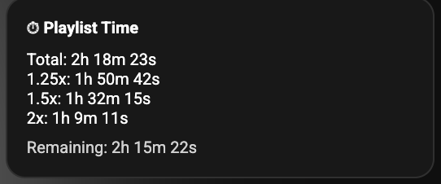
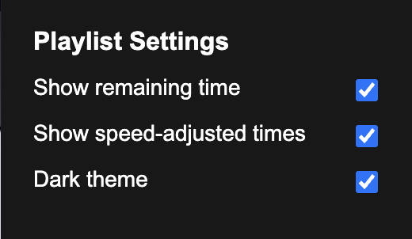

# YouTube Playlist Total Length

Adds total playlist duration, remaining time, and speed-adjusted times to YouTube playlists.

## Features

- Live updates remaining time as the video plays
- Shows total playlist time and adjusted times for 1.25x, 1.5x, 2x speed
- Dark/light theme
- Configurable settings via popup
- Injects clean UI into YouTube sidebar

## Screenshots

## Installation

1. Clone or download this repository
2. Go to `chrome://extensions` (or Opera extensions page)
3. Enable Developer Mode
4. Click "Load unpacked" and select this folder

## Usage

- Click the extension icon to open settings popup
- Toggle remaining time, speed-adjusted times, or theme
- Open a YouTube playlist to see the info in the sidebar

## License

MIT
